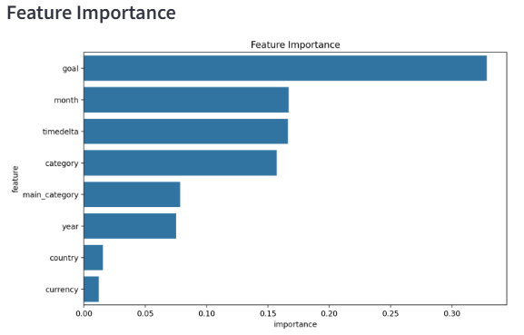
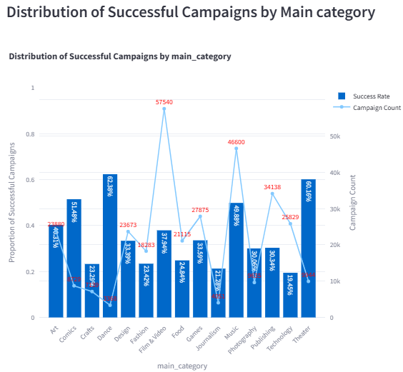
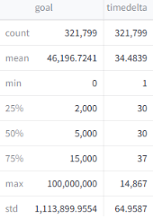

# moovai_test
Repo test technique pour DS à MoovAI

# How to use the repo
poetry shell
streamlit run app.py

The explo tab shows visualization I used while exploring the dataset
The modelisation tab shows the experiences i ran while exploring the modelisation of the problem
The client side tab shows an **utterly** simple front end solution I would provide to the client

# Question #1
Problèmes de qualité des données raw kickstarter
- Colonnes _Unnamed: x_ après loading du csv en dataframe: certains titres de campagnes contiennent des virgules ce qui est génant avec le csv. Compte tenu du faible nombre de lignes concernées, ces lignes sont supprimées
- Le nom des colonne contient un espace ' ' à la fin, cleanable simplement
- Colonnes inutiles : _ID_
- Format datetime dans les colonnes _launched_ et _deadline_
- Valeurs numéraires non homogènes dans la colonne _goal_ (ça je ne l'ai pas traité et maintenant que je rédige les réponses à la fin je me rends compte que j'aurais du !)
- Certaines campagnes sont 'undefined' dans la colonne _state_, possible de le reconstruire avec les autres colonnes (_goal_ et _pledged_)

# Question #2
Identification d'insights sur la contribution au succès ou non des campagnes

Le graph d'importance des features mets en évidence les leviers sur lesquels le client peut agir pour faire varier le taux de réussite de sa campagne

L'étude des histogrammes de distribution des données en fonction des différentes feature (ici _main category_) permet de mettre en évidence des outliers et des propriétés de distributions particulières, dont la création de feature peut en découler. En l'occurence j'en ai pas tellement crée à part _timedelta_ :D

La distribution des valeurs dans les colonnes _goal_ et _timedelta_ mets en évidence l'existence d'outliers (à prendre en compte, soit dans une partie engineering, soit dans le choix du scaler)

Concernant les facteurs de confusions je me rends compte lors de la rédaction des réponses que la non-homogénéité des valeurs numéraires dans la colonne _goal_ a certainement nuit au perf du modèle et nécessite un travail.
La feature _timedelta_ a présenté plus d'importance dans l'étude de feature importance que _launched_ et _dealine_ séparement et a donc naturellement fait l'objet d'une feature.

# Question #3
Au niveau de la solution de ML proposée, je me suis concentré sur deux apports de valeurs:
- Le premier conciste en un outil d'évaluation des chances de réussite d'une campagne à partir des informations qui lui sont propres. Cet outil peut être très utile pour que le client puisse se faire un avis sur la faisabilité de sa ou ses campagnes
- Dans un second temps ce qui peut l'intéresser c'est de savoir sur quel levier il pourra agir pour augmenter ses chances de réussite. D'où la seconde partie qui propose le graph de l'importance des features.

# Question #4
Dans l'hypothèse où ma solution serait en production avec un système de monitoring de sa performance, une dégradation progressive des performances du modèle conjugué avec une variation de la distribution des variables me ferait immédiatement penser à un cas de data drift.
Peut être due à des changement d'habitudes des utilisateurs, des facteurs macro-économique (inflation), ...
- Pour y faire face la première étape est d'être capable de le détecter donc d'avoir mis en place un monitoring, avec éventuellement des alertes, pour détecter ces variations de performance
- Pour s'assurer qu'il s'agit bien d'un data drift il faut étudier l'évolution de la distribution des données entre le moment de l'entrainement du modèle et maintenant
- S'il est avéré que les données ont évoluées alors il faut réentrainer le modèle à interval régulier avec une stratégie de fenêtre de temps des données utilisées pour chaque réentrainement